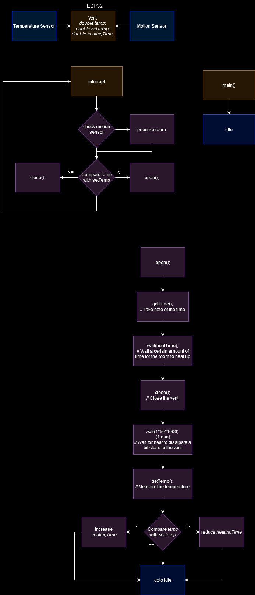

# Smart Vents
Solar Suitcase 2022 - 2023 \
IoT system for improved efficiency in multi-zoned heating

## Problem
Heat rises. When I lived in a multi-story house in Seattle, 
it was often below room temperature in the lower floor but 
quite hot upstairs. I sort of accepted the fact that rooms 
heat unevenly. However, large buildings usually have zones 
for heating to ensure a more even coverage. This is a decent fix,
but may be a bit limited in flexibility. For example, if a heating 
zone consists of a kitchen and a living room, the kitchen, with 
stoves, ovens, and fridges, may end up a lot warmer than the other
room (personal experience). And having the option and ability
to adjust to changes is a core part of smart devices.

## Solution
aa

#### Block Diagram

#### BOM
| Component    | Value |     Count  | Price      |
|--------------|------:|-----------:|-----------:|
| ESP32        |  -    |      2     |    $5.00   |
| R1           |  4.7K |      6     |    $0.00   |
| a           |  a |      a     |    $0.00   |

#### Demo
aa
