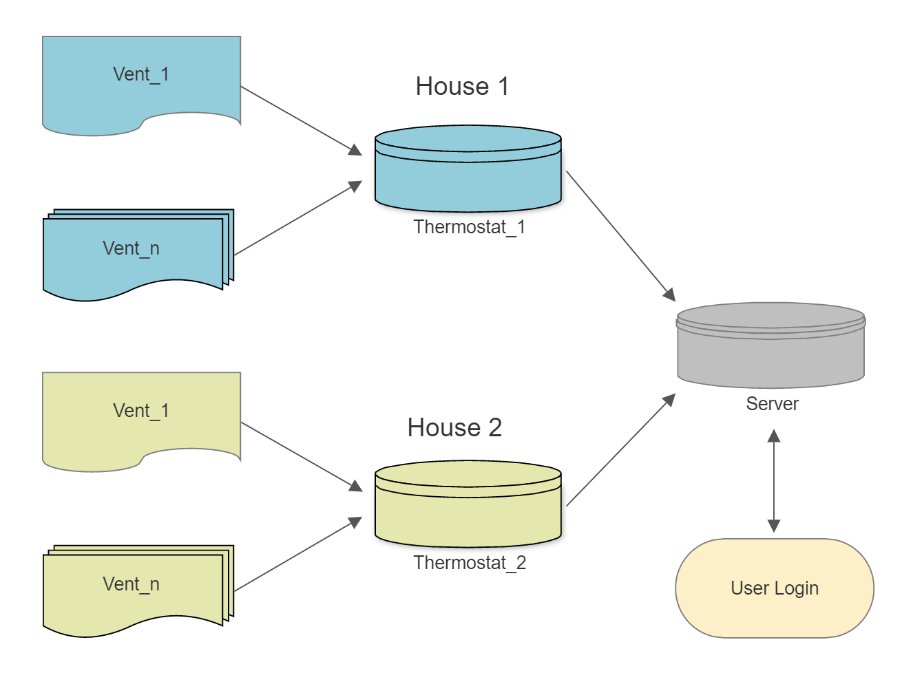
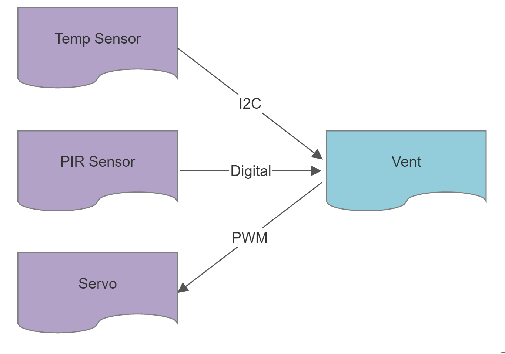

# Smart Vents
IoT system for improved efficiency in multi-zoned heating

## Problem
Heat rises. When I lived in a multi-story house in Seattle, 
it was often below room temperature in the lower floor but 
quite hot upstairs. I sort of accepted the fact that rooms 
heat unevenly. However, large buildings usually have zones 
for heating to ensure a more even coverage. This is a decent fix,
but may be a bit limited in flexibility. For example, if a heating 
zone consists of a kitchen and a living room, the kitchen, with 
stoves, ovens, and fridges, may end up a lot warmer than the other
room (personal experience). And having the option and ability
to adjust to changes is a core part of smart devices.

## Solution
Since each room has heating vents, they would provide a more 
precice form of measuring a room's temperature. Additionally, 
vents on the ceiling can have embedded motion sensors to detect 
if a room is occupied. Heating can then be prioritized for that 
room so it heats up faster. \
**Note:** Of course, automated features should always have a 
setting to manually override. In this case, that would be an 
option to heat every room in a traditional manner and disable 
room prioritiztion.

#### Block Diagram

###### Communitcation
 \
The ESP-NOW communication protocol will be used as the method of two-way communication between the thermostat and vents. The server also acts as a websocket server on the network in order to view the current temperatures of each room and set the temperature.

 \
A vent consists of an ESP32 as its CPU with Wi-Fi capabilities.
This will allow the vent to communicate with the thermostat or 
central hub. Each vent also has a temperature and motion sensor.

###### Start
The vent starts in low-power mode, and checks the temperature 
and motion sensor occasionally with an thread.

###### Main

The thermostat will initiate the heating process once it recieves a temperature that is lower than what is set. Of course, the comparison logic 
should consider the hysteresis--it would be bad to turn on and off the heater when the temperature dips slightly.
#### BOM
##### Server (one per system)
| Component    | Value        |  Count     |     Price   | Link      |
|--------------|:------------:|-----------:|------------:|----------:|
| U1           |  ESP32-S2    |      1     |    $5.00    |           |

Total: $5

##### Vent (one for every vent)
| Component    | Value        |  Count     |     Price   | Link      |
|--------------|:------------:|-----------:|------------:|----------:|
| U1           |  ESP32-S2    |      1     |    $5.00    |           |
| U2           |  BME280      |      1     |    $6.00    |           |
| Q1           |  2N3904      |      1     |    $1.00    |           |
| X1           |  EKMC1601111 |      1     |    $12.00   |           |
| M1           |  Servo       |      1     |    $5.00    |           |
| R1           |  1K          |      1     |      -      |           |
| R2           |  2K          |      1     |      -      |           |
| R3           |  1M          |      1     |      -      |           |
| R4           |  100K        |      1     |      -      |           |
| Vent         |  -           |      1     |    $10.00   |           |

Total: $39

#### Demo
To demonstrate the concept, a setup of different-sized heat-insulated boxes with thermometers attatched will simulate a house
