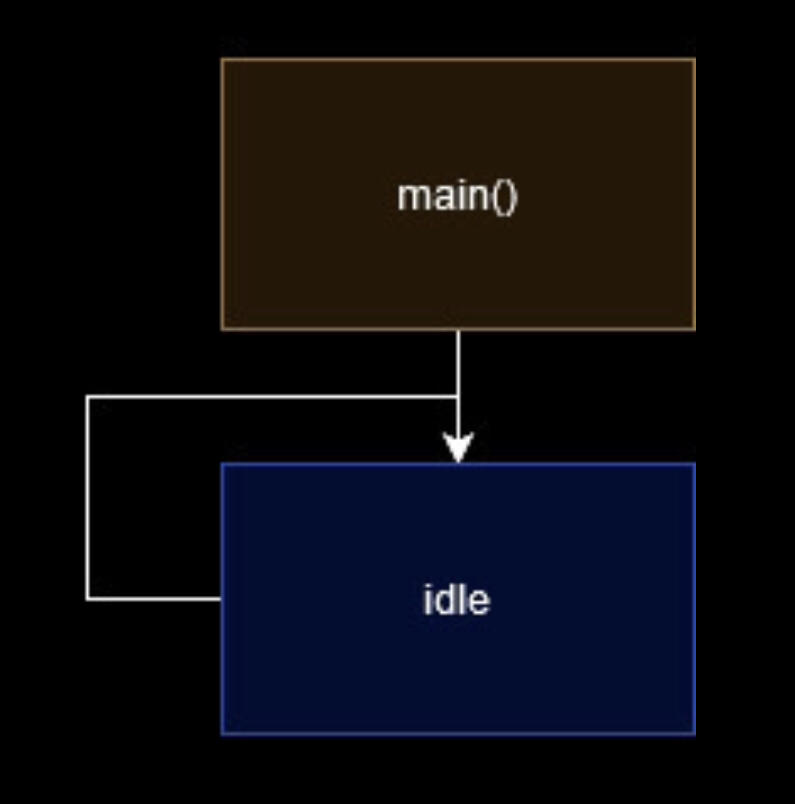

# Smart Vents
Solar Suitcase 2022 - 2023 \
IoT system for improved efficiency in multi-zoned heating

## Problem
Heat rises. When I lived in a multi-story house in Seattle, 
it was often below room temperature in the lower floor but 
quite hot upstairs. I sort of accepted the fact that rooms 
heat unevenly. However, large buildings usually have zones 
for heating to ensure a more even coverage. This is a decent fix,
but may be a bit limited in flexibility. For example, if a heating 
zone consists of a kitchen and a living room, the kitchen, with 
stoves, ovens, and fridges, may end up a lot warmer than the other
room (personal experience). And having the option and ability
to adjust to changes is a core part of smart devices.

## Solution
Since each room has heating vents, they would provide a more 
precice form of measuring a room's temperature. Additionally, 
vents on the ceiling can have embedded motion sensors to detect 
if a room is occupied. Heating can then be prioritized for that 
room so it heats up faster. \
**Note:** Of course, automated features should always have a 
setting to manually override. In this case, that would be an 
option to heat every room in a traditional manner and disable 
room prioritiztion.

#### Block Diagram

###### Hardware
 \
A vent consists of an ESP32 as its CPU with Wi-Fi capabilities.
This will allow the vent to communicate with the thermostat or 
central hub. Each vent also has a temperature and motion sensor.

###### Start
 \
The vent starts in low-power mode, and checks the temperature 
and motion sensor occasionally with an interrupt.

#### BOM
| Component    | Value |     Count  | Price      |
|--------------|------:|-----------:|-----------:|
| ESP32        |  -    |      2     |    $5.00   |
| R1           |  4.7K |      6     |    $0.00   |
| a            |  a    |      a     |    $0.00   |

#### Demo
tex text
